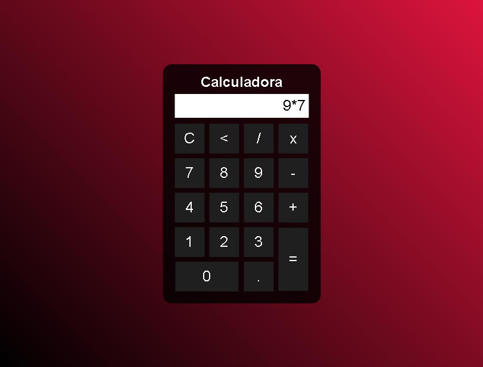

# Calculadora JS 

> Feito baseado no vídeo
[Como Criar uma SIMPLES CALCULADORA com HTML, CSS e JAVASCRIPT](https://www.youtube.com/watch?v=42TShjXR0m0)
Por Gustavo Neitzke

## Link para acesso!
[Clique aqui!](limaryan.github.io/calculadorajs)

## ⚙️Tecnologias

- HTML
- CSS
- JavaScript
- Git e Github

## 📮Contato
ryanvmlima01@gmail.com